Tablesaw
=======

[](http://www.apache.org/licenses/LICENSE-2.0) [](https://github.com/grooviter/tablesaw/actions/workflows/tablesaw-release.yml) 

### Overview

**Tablesaw** is a dataframe and visualization library that supports loading, cleaning, transforming, filtering, and summarizing data.

### Features

#### Data processing & transformation

- Import and export data: RDBMS, Excel, CSV, TSV, JSON, HTML, Fixed Width text files.
- Combine tables by appending or joining. 
- Add and remove columns or rows.
- Sort, Group, Filter, Edit, Transpose, etc. 
- Map/Reduce operations.
- Handle missing values.

#### Statistics

Descriptive stats such as mean, min, max, median, sum, product, standard deviation, variance, percentiles, 
geometric mean, skewness, kurtosis, etc.

#### Visualization

Tablesaw supports data visualization by providing a wrapper for the Plot.ly JavaScript plotting library. Here are a few examples of the new library in action.

<table>
  <tr>
    <td></td>
    <td>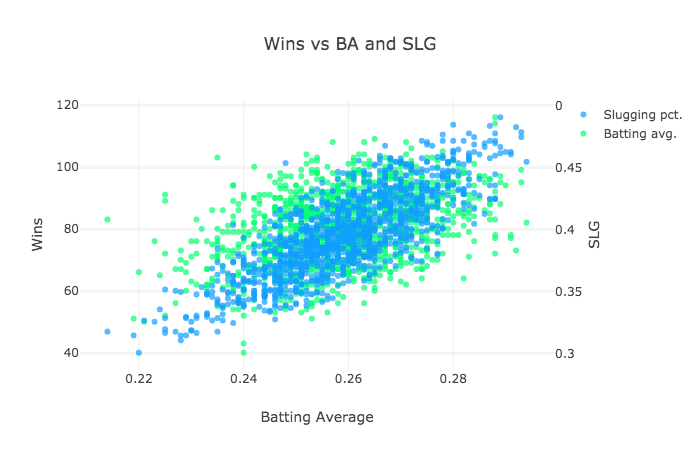</td>
    <td>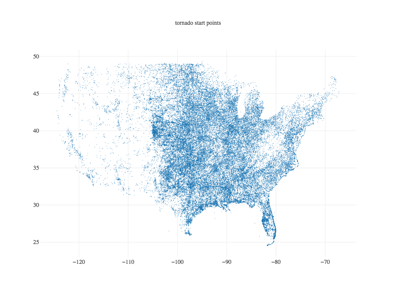</td>
    <td>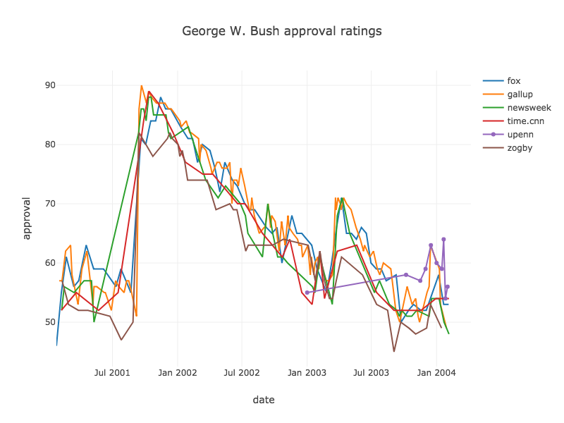</td> 
  </tr>
  <tr>
    <td>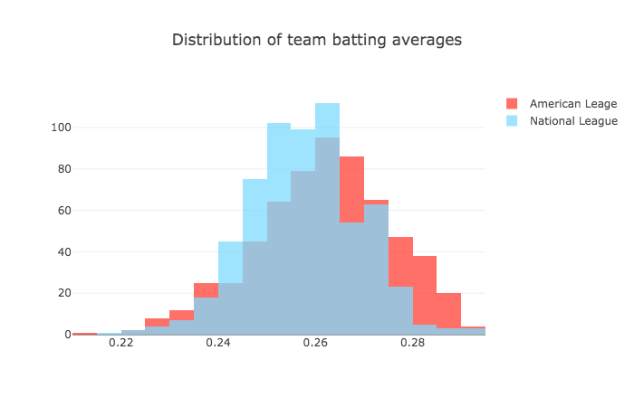</td>
    <td>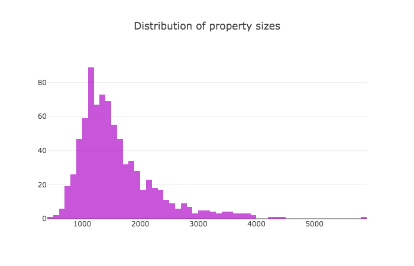</td>
    <td>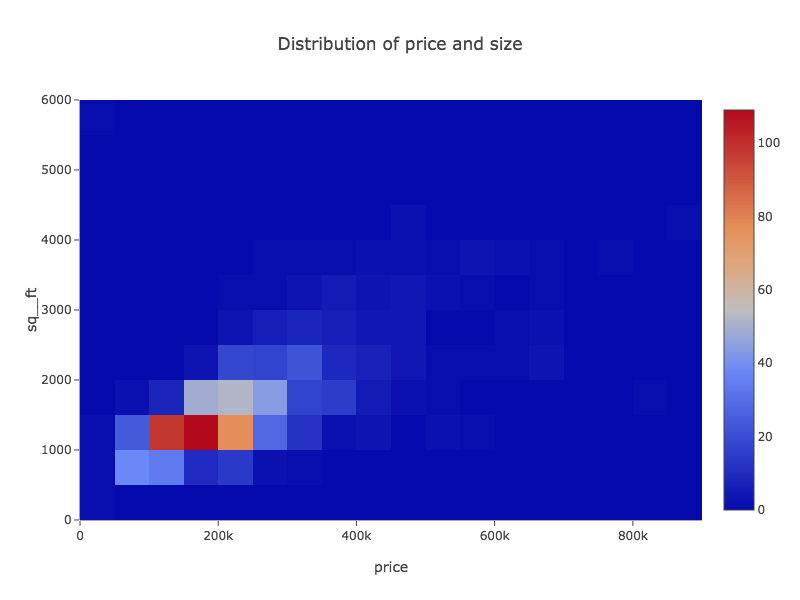</td>
    <td>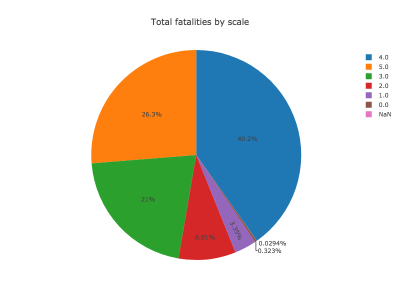</td> 
  </tr>
  <tr>
    <td>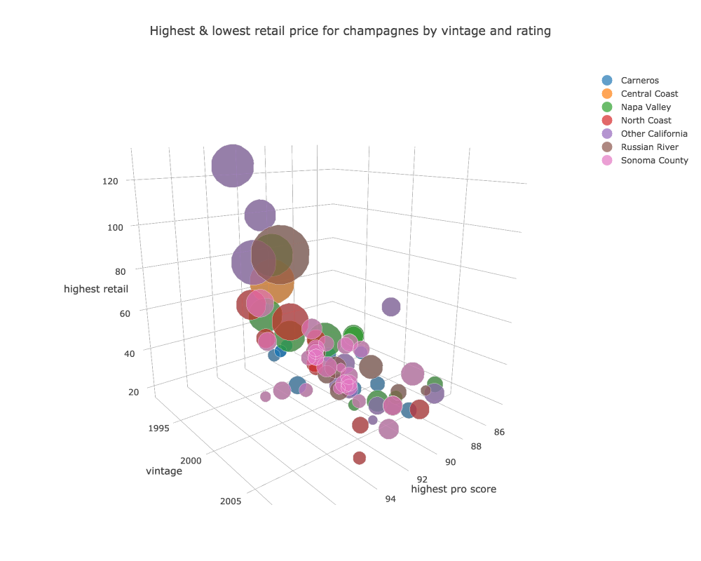</td>
    <td>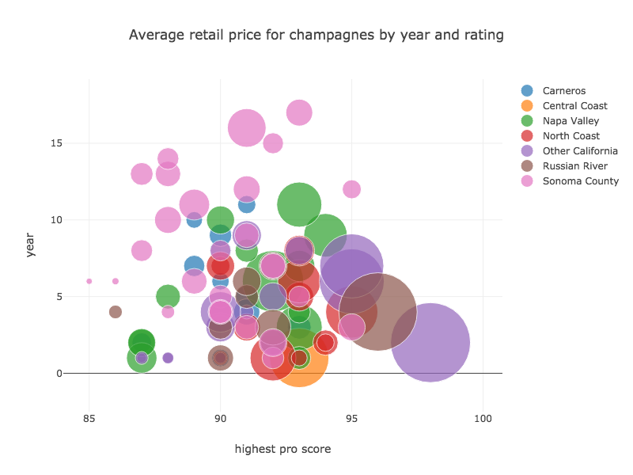</td>
    <td>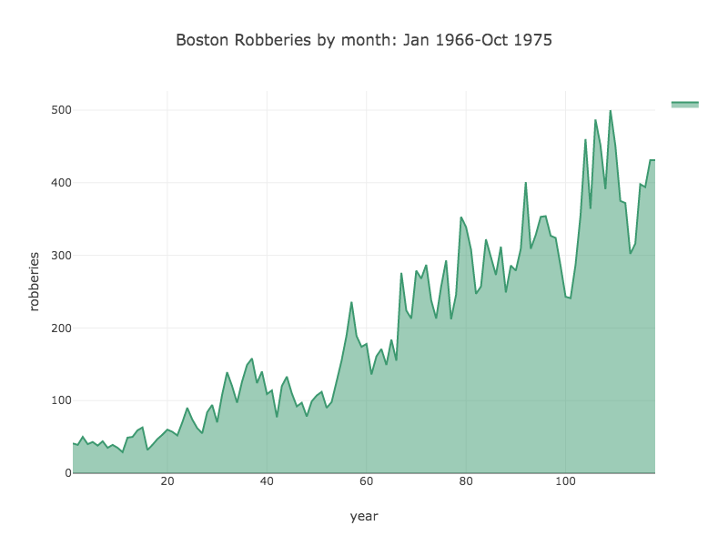</td>
    <td></td> 
  </tr>
  <tr>
    <td>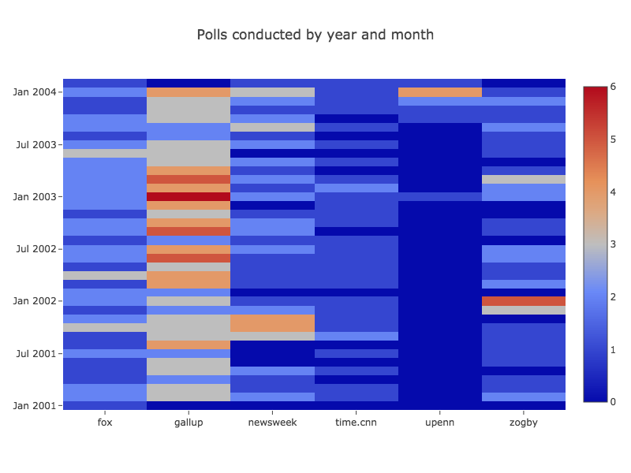</td>
    <td>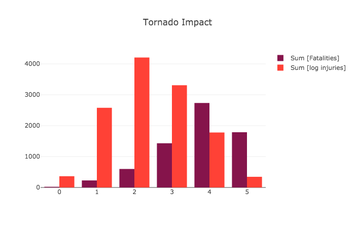</td>
    <td>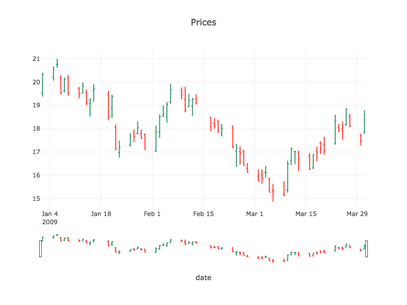</td>
    <td></td> 
  </tr>
</table>

### Getting started

Add tablesaw-core to your maven project. You can find the version number for the latest release in the [release notes](https://github.com/grooviter/tablesaw/releases) page:

```xml
<dependency>
    <groupId>com.github.grooviter</groupId>
    <artifactId>tablesaw-core</artifactId>
    <version>VERSION_NUMBER_GOES_HERE</version>
</dependency>
```

Or as a gradle dependency:

```groovy
implementation "com.github.grooviter:tablesaw-core:VERSION_NUMBER_GOES_HERE"
```

You may also add supporting projects:
- `tablesaw-beakerx` - for using Tablesaw inside [BeakerX](http://beakerx.com/)
- `tablesaw-excel` - for using Excel workbooks
- `tablesaw-html` - for using HTML
- `tablesaw-json` - for using JSON
- `tablesaw-jsplot` - for creating charts

External supporting projects - **outside of this organization**:
- [tablesaw-parquet](https://github.com/tlabs-data/tablesaw-parquet) - for using the [Apache Parquet](https://parquet.apache.org/) file format with Tablesaw ([report issue](https://github.com/tlabs-data/tablesaw-parquet/issues))

### Documentation and support

* Start with the [tutorial](https://grooviter.github.io/tablesaw/index.html#_tutorial) section
* Then check the full [documentation page](https://grooviter.github.io/tablesaw/) 
* Feature requests and bug reports can be made on the [issues tab](https://github.com/grooviter/tablesaw/issues).

### Integrations

#### Jupyter Notebooks

* We recommend trying Tablesaw inside [Jupyter notebooks](http://arogozhnikov.github.io/2016/09/10/jupyter-features.html), which lets you experiment with Tablesaw in a more interactive manner. Get started by [installing BeakerX](http://beakerx.com/documentation) and trying [the sample Tablesaw notebook](https://github.com/twosigma/beakerx/blob/master/doc/groovy/Tablesaw.ipynb)
* A second way to use Tablesaw inside [Jupyter notebooks](http://arogozhnikov.github.io/2016/09/10/jupyter-features.html) is with [IJava](https://github.com/SpencerPark/IJava), which has built-in support for Tablesaw. Gary Sharpe has written [an excellent tutorial](https://medium.com/@gmsharpe/java-jupyter-plotly-e1bbaa7f2be8) that shows you how to use Tablesaw plots. Gary has written a number of other tutorials that feature Tablesaw:
  * [Tidy Data with Java & Jupyter](https://medium.com/@gmsharpe/tidy-data-with-java-jupyter-b1e131b37ab0)
  * [Dataframes with Tablesaw — JSON](https://medium.com/@gmsharpe/dataframes-with-tablesaw-json-46dda9c8c217?source=your_stories_page----------------------------------------)
  * [Dataframes with Tablesaw — CSV Files](https://medium.com/@gmsharpe/importing-data-with-tablesaw-part-1-csv-files-3ac6f135cf6f?source=your_stories_page----------------------------------------)
* A third approach is to use [Google Colab](https://colab.research.google.com). Again, Gary Sharpe has an excellent tutorial:[Getting Started with Dataframes using Java and Google Colab](https://medium.com/@gmsharpe/getting-started-with-tablesaw-and-google-colab-65ef0cbe280c)

#### Other integrations

* Eclipse uses may find [etablesaw](https://github.com/hallvard/etablesaw) useful. It provides Eclipse integration aimed at turning Eclipse into a data workbench.
* You may utilize Tablesaw with many machine learning libraries. To see an example of using Tablesaw with [Smile](https://haifengl.github.io) check out [the sample Tablesaw Jupyter notebook](https://github.com/twosigma/beakerx/blob/master/doc/groovy/Tablesaw.ipynb)
* You may use [quandl4j-tablesaw](http://quandl4j.org) if you'd like to load financial and economic data from [Quandl](https://www.quandl.com) into Tablesaw. This is demonstrated in [the sample Tablesaw notebook](https://github.com/twosigma/beakerx/blob/master/doc/groovy/Tablesaw.ipynb) as well

### Credits

This repository was born as a fork of the original [Tablesaw](https://github.com/jtablesaw/tablesaw) project.

### License

This project is licensed under the [Apache 2.0](https://www.apache.org/licenses/LICENSE-2.0)